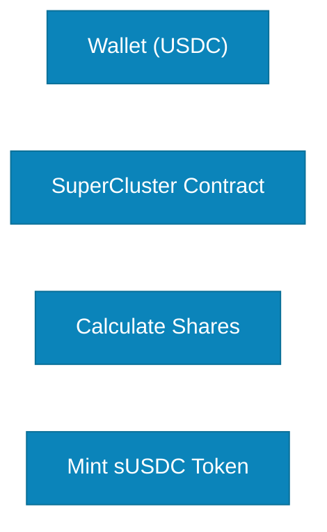

# Mint sUSDC

After you deposit USDC into SuperCluster, the protocol automatically mints **sUSDC** (SuperCluster USDC) tokens to your wallet. These are your liquid saving tokens that represent ownership of your deposited USDC plus accumulated yield.

## What is sUSDC?

**sUSDC** is a **rebasing token** - a liquid receipt token that automatically increases in balance as yield is distributed through the rebase mechanism.

### Key Characteristics

| Feature              | Description                        |
| -------------------- | ---------------------------------- |
| **Type**             | Rebasing ERC-20 Token              |
| **Initial Ratio**    | 1 USDC = 1 sUSDC                   |
| **Balance Behavior** | Increases automatically with yield |
| **Transferable**     | Yes, freely tradable               |
| **Composable**       | Yes, usable across DeFi            |

## How sUSDC Works

### The Rebasing Mechanism

Unlike regular tokens where your balance stays constant, sUSDC uses a **rebasing mechanism**:

```
Your sUSDC Balance = Your Shares × Current Exchange Rate
```

## Minting Process

### Automatic Minting

When deposit USDC, sUSDC is minted automatically in the same transaction:



### Exchange Rate Calculation

```solidity
// Initial deposit (first time)
Exchange Rate = 1.0
sUSDC Minted = USDC Deposited × 1.0

// Subsequent deposits (after yield accrual)
Exchange Rate = Total Assets / Total Supply
sUSDC Minted = USDC Deposited / Exchange Rate
```

## What Can You Do With sUSDC?

### 1. Hold and Earn

- Simply hold in your wallet
- Balance automatically increases with rebase
- Watch your savings grow

### 2. Transfer

- Send to other addresses
- Gift or payment
- Fully transferable

### 3. Wrap to wsUSDC

- Convert to non-rebasing token
- Better for DeFi integrations
- See [Wrap to wsUSDC](./wrap-ws-usdc.md)

### 4. Use in DeFi

- Provide liquidity on DEX
- Use as collateral (with compatible protocols)
- Participate in DeFi strategies
- See [Use in DeFi](./use-in-defi.md)

### 5. Withdraw

- Request withdrawal to get USDC back
- Or swap directly on DEX
- See [Two-Step Withdrawal](./two-step-withdrawal.md)

## Technical Details

### Token Standard

**sUSDC** implements a modified ERC-20 with rebasing functionality:

```solidity
interface IsUSDC {
    // Standard ERC-20 functions
    function balanceOf(address account) external view returns (uint256);
    function transfer(address to, uint256 amount) external returns (bool);
    function approve(address spender, uint256 amount) external returns (bool);

    // Rebasing-specific functions
    function sharesOf(address account) external view returns (uint256);
    function getSharesByAmount(uint256 amount) external view returns (uint256);
    function getAmountByShares(uint256 shares) external view returns (uint256);
}
```

## Advantages of sUSDC

### Automatic Yield Accumulation

- No need to claim or compound
- Balance grows automatically
- Gas-efficient for users

### Transparent Value

- Balance reflects total value directly
- Easy to track earnings
- No complex calculations needed

### Full Liquidity

- Instantly transferable
- Tradable on DEX
- No lock-up period

## Limitations & Considerations

### DeFi Integration Challenges

Some DeFi protocols don't support rebasing tokens:

- Some AMMs
- Certain yield aggregators

**Solution:** Wrap to **[wsUSDC](./wrap-ws-usdc.md)** for full compatibility

### Track Yield

```
Yield Earned = Current Balance - Initial Deposit
APY = (Yield Earned / Initial Deposit) × (365 / Days Held) × 100%
```

### View Shares

- Call `sharesOf(yourAddress)` on contract
- Shares remain constant
- Balance changes with exchange rate

**Congratulations! You now hold liquid**, yield-bearing sUSDC tokens. Watch your savings grow automatically.
