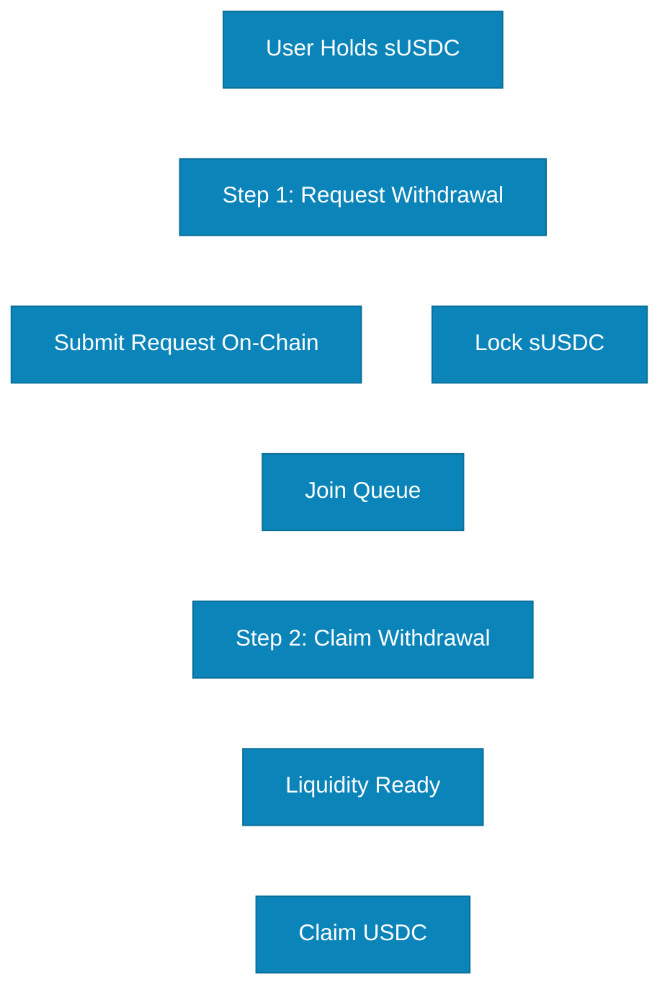

# Two-Step Withdrawal

SuperCluster uses a **two-step withdrawal process** to ensure stable liquidity management and prevent bank-run scenarios. This process requires users to first request a withdrawal, then claim their funds once the protocol has prepared the liquidity.

## Why Two-Step Withdrawal?

Your USDC is actively deployed in lending protocols. The two-step process ensures orderly liquidation and fair treatment of all withdrawers.

## The Two Steps

### Step 1: Request Withdrawal

Submit withdrawal request on-chain. Your sUSDC is locked and request joins the queue.

### Step 2: Claim Withdrawal

Once liquidity is ready, claim your USDC. Typically takes 30 minutes to 2 hours.

## Complete Withdrawal Flow

**Access your funds with confidence!** Withdraw your USDC through our secure two-step process or swap instantly on DEX for immediate liquidity.
