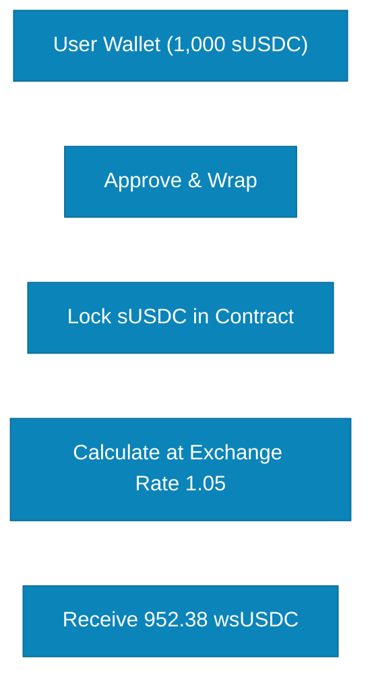
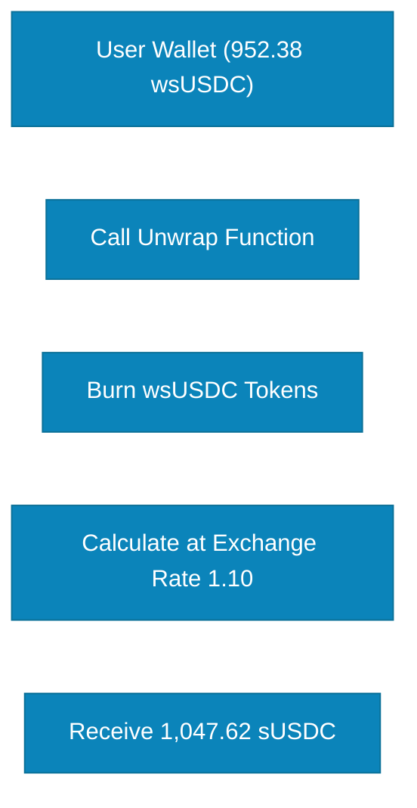

# Wrap to wsUSDC

Wrapping converts your **sUSDC** (rebasing token) into **wsUSDC** (wrapped SuperCluster USDC) - a non-rebasing token that maintains a constant token count while its exchange value increases over time.

## What is wsUSDC?

**wsUSDC** is a **wrapped, non-rebasing token** that represents your sUSDC holdings in a static balance format optimized for DeFi integrations.

### Key Characteristics

| Feature              | Description                      |
| -------------------- | -------------------------------- |
| **Type**             | Non-Rebasing ERC-20 Token        |
| **Balance Behavior** | Stays constant                   |
| **Value per Token**  | Increases over time              |
| **Transferable**     | Yes, freely tradable             |
| **Composable**       | Yes, better DeFi compatibility   |
| **Convertible**      | Can unwrap back to sUSDC anytime |

### Use Cases for wsUSDC

**1. Collateral in Lending Protocols**

```
Deposit wsUSDC → Borrow other assets → wsUSDC value appreciates
```

**2. Liquidity Provision**

```
Provide wsUSDC/USDC pair → Earn trading fees + yield appreciation
```

**3. Cross-Protocol Strategies**

```
Use wsUSDC in vault strategies → Maintain SuperCluster yield + strategy returns
```

**4. Accounting & Tracking**

```
Fixed token count → Easier accounting → Value appreciation tracked separately
```

## How Wrapping Works

### The Wrapping Mechanism

When you wrap sUSDC into wsUSDC:



### Exchange Rate Formula

```
wsUSDC Amount = sUSDC Amount / Exchange Rate

Exchange Rate = Total Assets / Total Supply
```

**Example:**

```
You have: 1,000 sUSDC
Current exchange rate: 1.05 (5% yield accrued)

You wrap:
wsUSDC received = 1,000 / 1.05 = 952.38 wsUSDC

Value check:
952.38 wsUSDC × 1.05 = 1,000 USDC equivalent ✓
```

## Step-by-Step Wrapping Process

### Step 1: Hold sUSDC

Ensure you have sUSDC in your wallet:

- Must have deposited USDC first
- Check your sUSDC balance
- Decide how much to wrap

### Step 2: Approve sUSDC

```solidity
sUSDC.approve(wsUSDCAddress, amount)
```

Grant permission to wrap contract to use your sUSDC.

### Step 3: Call Wrap Function

```solidity
wsUSDC.wrap(sUSDCAmount)
```

**Parameters:**

- `sUSDCAmount`: Amount of sUSDC to wrap

### Step 4: Receive wsUSDC

Transaction confirms:

- sUSDC is locked in contract
- wsUSDC is minted to your address
- You now hold non-rebasing tokens

### Step 5: Use wsUSDC in DeFi

Deploy your wsUSDC:

- Use as collateral
- Provide liquidity
- Participate in strategies

## Unwrapping Process

### Convert wsUSDC Back to sUSDC

Unwrapping is equally simple:



### Unwrap Function

```solidity
wsUSDC.unwrap(wsUSDCAmount)
```

**Returns:**

```
sUSDC Amount = wsUSDC Amount × Current Exchange Rate
```

**Example:**

```
You have: 952.38 wsUSDC
Current exchange rate: 1.10 (10% yield accrued)

You unwrap:
sUSDC received = 952.38 × 1.10 = 1,047.62 sUSDC

Value: 1,047.62 USDC equivalent
```

## Value Appreciation Over Time

### How wsUSDC Value Increases

Unlike sUSDC where balance increases, wsUSDC value per token increases:

```
Day 1:   Wrap 1,000 sUSDC → Get 1,000 wsUSDC (rate: 1.0)
         1 wsUSDC = 1.00 USDC

Day 30:  After rebase (rate: 1.004)
         Balance: Still 1,000 wsUSDC
         1 wsUSDC = 1.004 USDC
         Total value: 1,004 USDC

Day 365: After 1 year (rate: 1.05)
         Balance: Still 1,000 wsUSDC
         1 wsUSDC = 1.05 USDC
         Total value: 1,050 USDC
```

### Comparison Chart

| Time    | sUSDC Balance | wsUSDC Balance | Exchange Rate | sUSDC Value | wsUSDC Value |
| ------- | ------------- | -------------- | ------------- | ----------- | ------------ |
| Day 1   | 1,000         | 1,000          | 1.00          | 1,000 USDC  | 1,000 USDC   |
| Month 1 | 1,004.17      | 1,000          | 1.00417       | 1,004 USDC  | 1,004 USDC   |
| Month 6 | 1,025.00      | 1,000          | 1.025         | 1,025 USDC  | 1,025 USDC   |
| Year 1  | 1,050.00      | 1,000          | 1.05          | 1,050 USDC  | 1,050 USDC   |

**Key Insight:** Both have identical value, just represented differently!

## Gas Costs

**Estimated Gas Usage:**

| Operation       | Gas Estimate     | Notes                        |
| --------------- | ---------------- | ---------------------------- |
| Wrap            | ~50,000 - 80,000 | First-time higher (approval) |
| Unwrap          | ~40,000 - 60,000 | No approval needed           |
| Transfer wsUSDC | ~21,000 - 30,000 | Standard ERC-20              |

**Optimization Tips:**

- Wrap larger amounts to optimize gas per token
- Batch operations when possible
- Consider gas prices on Lisk Network

## Advantages of wsUSDC

### Universal DeFi Compatibility

- Works with ALL standard DeFi protocols
- No special integration required
- Standard ERC-20 behavior

### Simplified Accounting

- Fixed token count
- Easy to track in portfolio
- Clear value appreciation

### Better for Trading

- Predictable token amount
- Easier for limit orders
- Standard DEX integration

### Collateral Optimization

- Value appreciation improves health factor
- Reduces liquidation risk over time
- Standard collateral calculations

### Tax Efficiency (Potentially)

- No automatic balance increase
- Value appreciation not realized until unwrap/sell
- Consult tax professional

## When to Use wsUSDC vs sUSDC

### Use sUSDC When:

- Holding for simple savings
- Want to see balance grow directly
- Not using in complex DeFi strategies
- Prefer transparent yield display

### Use wsUSDC When:

- Using as collateral in lending protocols
- Providing liquidity on DEXs
- Integrating with yield aggregators
- Need fixed token count for accounting
- Trading on exchanges
- Building on top of SuperCluster

## Comparison Table

| Feature                | sUSDC                      | wsUSDC                  |
| ---------------------- | -------------------------- | ----------------------- |
| **Balance**            | Increases (rebasing)       | Constant (non-rebasing) |
| **Value per token**    | ~1 USDC                    | Increases over time     |
| **Best for**           | Simple holding             | DeFi integration        |
| **Wallet display**     | Shows total value          | Shows token count       |
| **DeFi compatibility** | Limited                    | Universal               |
| **Gas cost**           | Lower (no wrap)            | Higher (wrap + unwrap)  |
| **Accounting**         | Complex (changing balance) | Simple (fixed balance)  |
| **Trading**            | May confuse traders        | Standard behavior       |

**Ready to maximize DeFi compatibility?** Wrap your sUSDC to wsUSDC and unlock universal protocol integration.
