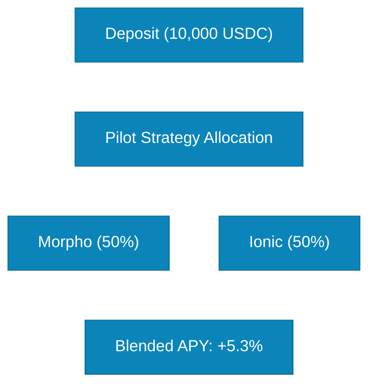

# Yield Accrual (Rebase)

Yield accrual in SuperCluster happens through a **rebase mechanism** a process that distributes earned yield proportionally to all token holders by updating the exchange rate between sUSDC and USDC.

## What is a Rebase?

A **rebase** is the event where SuperCluster:

1. Collects yield from all lending protocols
2. Updates the exchange rate
3. Distributes yield to all sUSDC holders proportionally

**Result:**

- sUSDC holders see balance increase automatically
- wsUSDC holders see value per token increase
- No action required from users

## How Yield is Generated

### Multi-Protocol Yield Sources

Deposited USDC generates yield from multiple lending protocols:



### Yield Calculation

**Blended APY Formula:**

```
Blended APY = Σ (Allocation % × Protocol APY)

(50% × 6%) + (50% × 5.6%)
= 3.0% + 2.8%
= +5.8% APY
```

## Rebase Mechanism Explained

### Before Rebase

```
Protocol State:
- Total Assets: 1,000,000 USDC
- Total sUSDC Supply: 1,000,000 sUSDC
- Exchange Rate: 1.00

Your Holdings:
- sUSDC Balance: 10,000 sUSDC
- Value: 10,000 USDC
```

### During Rebase

**Step 1: Yield Collection**

```
Adapters harvest yield from protocols:
- Morpho:   +3,000 USDC (50%)
- Ionic:    +2,800 USDC (50%)
-----------------------
Total Yield: +5,800 USDC
```

**Step 2: Exchange Rate Update**

```
New Total Assets = 1,000,000 + 5,800 = 1,005,800 USDC
Total Supply = 1,000,000 sUSDC (unchanged)

New Exchange Rate = 1,005,800 / 1,000,000 = 1.0058
```

**Step 3: Balance Update**

```
Your new balance = Shares × New Exchange Rate
                 = 10,000 × 1.0058
                 = 10,058 sUSDC
```

### After Rebase

```
Protocol State:
- Total Assets: 1,005,800 USDC
- Total sUSDC Supply: 1,000,000 sUSDC (supply number unchanged)
- Exchange Rate: 1.0058

Your Holdings:
- sUSDC Balance: 10,058 sUSDC (+58 sUSDC)
- Value: 10,058 USDC (+58 USDC yield)
```

**Process:**

```
1. Collects yield from protocols
2. Verifies total assets
3. Calls rebase() function
4. Exchange rate updates
5. Balances adjust automatically
```

## How Rebase Affects

### If Hold sUSDC

**Balance Increases:**

```
Before Rebase:
sUSDC Balance: 1,000 sUSDC
Value: 1,000 USDC

After Rebase (1% yield):
sUSDC Balance: 1,010 sUSDC (+10 sUSDC)
Value: 1,010 USDC (+10 USDC)
```

## Rebase Mathematics

### Share-Based System

Super Cluster uses a **share-based** system to ensure fair yield distribution:

```
User Balance = User Shares × (Total Assets / Total Shares)
```

**Example:**

| User   | Shares | Assets | Supply | Exchange Rate | Balance   |
| ------ | ------ | ------ | ------ | ------------- | --------- |
| User A | 100    | 1,000  | 1,000  | 1.0           | 100 sUSDC |
| User B | 50     | 1,000  | 1,000  | 1.0           | 50 sUSDC  |

**After Rebase (10% yield):**

| User   | Shares | Assets | Supply | Exchange Rate | Balance   |
| ------ | ------ | ------ | ------ | ------------- | --------- |
| User A | 100    | 1,100  | 1,000  | 1.1           | 110 sUSDC |
| User B | 50     | 1,100  | 1,000  | 1.1           | 55 sUSDC  |

**Key Point:** Shares never change, but balance increases proportionally.

### Proportional Distribution

Yield is always distributed **proportionally**:

```
Your Yield = (Your Shares / Total Shares) × Total Yield
```

**Example:**

```
You own: 10,000 shares
Total shares: 1,000,000 shares
Your ownership: 1%

Total yield: 5,400 USDC

Your yield = 1% × 5,400 = 54 USDC
```

## Real-World Example

### Year 1 Rebase Timeline

**Initial Deposit:**

```
Day 0: Deposit 10,000 USDC
       Receive 10,000 sUSDC
       Exchange Rate: 1.000
```

**Monthly Rebases (5% Annual APY):**

| Month | Yield  | New Balance | Exchange Rate | Total Value |
| ----- | ------ | ----------- | ------------- | ----------- |
| 0     | -      | 10,000.00   | 1.0000        | 10,000 USDC |
| 1     | +41.67 | 10,041.67   | 1.0042        | 10,042 USDC |
| 2     | +41.84 | 10,083.51   | 1.0084        | 10,084 USDC |
| 3     | +42.01 | 10,125.52   | 1.0126        | 10,126 USDC |
| 6     | +43.05 | 10,253.15   | 1.0253        | 10,253 USDC |
| 12    | +45.65 | 10,500.00   | 1.0500        | 10,500 USDC |

**Total Yield After 1 Year:** 500 USDC (5% APY)

### Compound Growth

Yield compounds automatically through rebase:

```
Year 1: 10,000 → 10,500 (+500)
Year 2: 10,500 → 11,025 (+525)
Year 3: 11,025 → 11,576 (+551)

Total: +1,576 USDC (15.76% over 3 years)
```

### Check Your Yield

**Calculate Earned Yield:**

```

Current Balance - Initial Deposit = Total Yield

Example:
Current: 10,500 sUSDC
Initial: 10,000 sUSDC
Yield: 500 sUSDC (500 USDC worth)

```

**Calculate APY:**

```

APY = (Current Value / Initial Deposit - 1) × (365 / Days Held) × 100%

Example:
Current: 10,500 USDC
Initial: 10,000 USDC
Days held: 365

APY = (10,500 / 10,000 - 1) × (365 / 365) × 100%
= 0.05 × 1 × 100%
= 5%

```

## Yield Optimization

### Pilot Strategy Rebalancing

The Pilot Strategy optimizes yield by rebalancing allocations:

**Before Rebalance:**

```

Protocol APY:

- Morpho: 6.0% (50% allocation)
- Ionic: 5.6% (50% allocation)

Blended APY: 5.8%

```

**After Rebalance (Morpho APY increased):**

```

New Allocation:

- Morpho: 6.5% (55% allocation) ← APY Increased!
- Ionic: 5.6% (45% allocation)

New Blended APY: 6.07%

```

**Result:** Higher yield for all users through automatic optimization.

## Factors Affecting Yield

### Positive Factors

1. **High Protocol APYs**

   - Increased lending demand
   - Protocol incentives
   - Market conditions

2. **Optimal Allocation**

   - Pilot Strategy finds best yields
   - Diversification reduces risk
   - Automatic rebalancing

3. **Compound Growth**
   - Yield reinvested automatically
   - Exponential growth over time

### Negative Factors

1. **Low Protocol APYs**

   - Decreased lending demand
   - Market downturn
   - Excess liquidity

2. **Protocol Fees**

   - Underlying protocol fees
   - Reduces net APY

## Comparison with Other Protocols

| Feature          | SuperCluster      | Traditional Staking | Yield Aggregators      |
| ---------------- | ----------------- | ------------------- | ---------------------- |
| **Rebase**       | Yes (automatic)   | Varies              | No (claim needed)      |
| **Frequency**    | Daily             | Varies              | Manual claim           |
| **Compound**     | Automatic         | Automatic           | Manual                 |
| **Liquidity**    | Full (via tokens) | Limited             | Limited (vault shares) |
| **Asset Type**   | Stablecoin        | Volatile            | Mixed                  |
| **Yield Source** | Multi-protocol    | Single              | Multi-strategy         |

**Sit back and earn!** Your balance grows automatically with every rebase.
